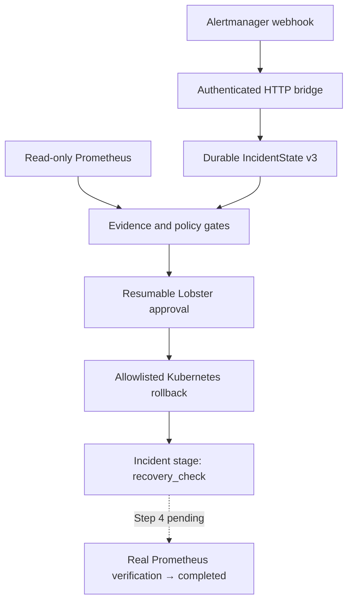

# OpenClaw DataOps Guardian

[](https://github.com/YingzuoLiu/openclaw-dataops-guardian/actions/workflows/ci.yml)

**Evidence-gated incident remediation for OpenClaw:** authenticated Alertmanager
ingestion, read-only Prometheus investigation, restart-safe human approval, and
an administrator-allowlisted Kubernetes Deployment rollback.

Guardian explores a specific reliability question: **how can an LLM-assisted
operations workflow investigate and propose a change without letting model text
become the authority to mutate infrastructure?** The answer in this repository
is a durable state machine surrounded by deterministic Tool, Reducer, approval,
allowlist, idempotency, and finalization gates.

> **Current status:** Steps 1-3 are complete and proven. The rollback is real
> and runs against an isolated kind cluster; post-rollback Prometheus recovery
> verification is still synthetic. This is a safety-focused prototype, not a
> production or multi-cluster remediation system.

## System at a glance



OpenClaw Gateway sessions persist the incident state. If the Gateway restarts
or a delivery is replayed, Guardian reconciles the stored attempt with the live
Deployment instead of blindly issuing another mutation.

## What is verified

| Boundary | Implemented guarantee | Reproducible evidence |
|---|---|---|
| Alert ingestion | Bearer-token-authenticated loopback HTTP bridge, Alertmanager v4 canonicalization, bounded deduplication, durable deferred-delivery checkpoints | [HTTP bridge contract](docs/alertmanager-http-bridge.md) |
| Evidence | Alert payloads never count as evidence; Prometheus is read-only and its endpoint remains administrator-owned | [Prometheus adapter](docs/prometheus-adapter.md), [evidence gates](docs/evidence-gates.md) |
| State and restart | Schema-v3 incident state, occurrence identity, attempt history, restart reconciliation, and replay-safe transitions | [IncidentState v3](docs/incident-state-v3.md) |
| Approval | Real Lobster run/resume path with pending, approved, and running checkpoints persisted through Gateway sessions | [Lobster compatibility proof](docs/proof-3-lobster-approval.md), [PR #8](https://github.com/YingzuoLiu/openclaw-dataops-guardian/pull/8) |
| Kubernetes mutation | Exact Deployment target, administrator allowlist, UID/revision/template-digest checks, optimistic concurrency, and audit annotations | [Rollback contract](docs/kubernetes-deployment-rollback.md) |
| Idempotency | The same occurrence and key cannot mutate twice; a genuinely new occurrence can execute a later rollback | [Real kind proof](docs/kubernetes-deployment-rollback.md#running-the-real-kind-proof) |

## Results

- **Real integration proof:** approved rollback changed a kind Deployment from
  revision 2 to revision 3 and restored the prior PodTemplate
  (`pause:3.10` to `pause:3.9`). Duplicate calls and post-restart replay left
  the Deployment unchanged; a new occurrence remained eligible for a later
  rollback.
- **Automated checks at Step 3 merge:** TypeScript build plus 235 tests across
  24 test files passed on Node.js 22.19.0 and Node.js 24.
- **Real-model A/B evaluation:** in 24 paired trials, the language-only baseline
  released 3 unsupported conclusions in 12 trials; the gated arm released 0 in
  12. All observed baseline failures came from one deliberately adversarial
  scenario, so this is a narrow reproducible result rather than a production
  failure-rate claim. See the
  [formal result](docs/openrouter-ab-formal-result.md) and
  [machine-readable evidence](evals/openrouter-ab/formal-2026-07-19.json).

## Quickstart

Prerequisites:

- Node.js `>=22.19.0`
- npm

```bash
git clone https://github.com/YingzuoLiu/openclaw-dataops-guardian.git
cd openclaw-dataops-guardian
npm ci
npm run check
```

The standard check is local and does not contact a production monitoring or
Kubernetes environment.

### Run the strongest integration proof

The Step 3 proof creates and removes its own isolated cluster. It requires a
Linux/WSL shell, Docker, `kind`, and `kubectl`:

```bash
npm run kubernetes:kind-rollback-proof
```

It exercises the real Lobster approval/resume entry, Gateway-backed incident
checkpoint, Gateway restart readback, allowlisted Deployment rollback,
occurrence-level idempotency, valid second occurrence, and deterministic
cleanup. It does not implement Step 4 recovery verification.

## Reproducible proof suite

| Command | What it demonstrates |
|---|---|
| `npm run state:v3:restart-proof` | IncidentState v3 persists across Gateway restart |
| `npm run state:restart-reconciliation-proof` | Interrupted attempts reconcile with external state without duplicate mutation |
| `npm run alertmanager:ingestion-proof` | Canonicalization, deduplication, and reducer behavior |
| `npm run alertmanager:http-bridge-proof` | Authenticated webhook ingestion and durable bridge checkpoints |
| `npm run policy:proof` | Loader-backed policy and Hook registration |
| `npm run hooks:live-proof` | Live Gateway finalization gate with a scripted local model |
| `npm run kubernetes:kind-rollback-proof` | Real approval, restart, rollback, idempotency, and cleanup in kind |
| `npm run eval:openrouter:plan` | No-cost preview of the optional paid A/B schedule |

Some proofs start an isolated OpenClaw Gateway and temporary local services.
Follow the linked contracts and never point proof scripts at a normal OpenClaw
profile or production cluster. Re-running paid model trials is opt-in and
requires the caller to supply `OPENROUTER_API_KEY`.

## Five-step project status

| Step | Scope | Status | Evidence |
|---|---|---|---|
| 1 | IncidentState v3, occurrence identity, durable restart reconciliation | Complete | [State contract](docs/incident-state-v3.md), [PR #5](https://github.com/YingzuoLiu/openclaw-dataops-guardian/pull/5) |
| 2a | Alertmanager v4 canonicalization, bounded deduplication, and fail-closed reducer | Complete | [PR #6](https://github.com/YingzuoLiu/openclaw-dataops-guardian/pull/6) |
| 2b | Authenticated HTTP bridge and durable delivery checkpoints | Complete | [PR #7](https://github.com/YingzuoLiu/openclaw-dataops-guardian/pull/7) |
| 3 | Real, gated, allowlisted Kubernetes Deployment rollback in kind | Complete | [PR #8](https://github.com/YingzuoLiu/openclaw-dataops-guardian/pull/8) |
| 4 | Real post-rollback Deployment and Prometheus recovery verification | Planned | Recovery currently stops at `recovery_check` |
| 5 | Complete fault/safety proof and final reproducible demo | Planned | Final project completion gate |

## Security model and non-goals

The model cannot provide a kubeconfig, API server, arbitrary JSON Patch, shell
command, or `kubectl` arguments. Administrator configuration owns the
Prometheus endpoint and Kubernetes allowlist. Before a write, Guardian checks
the cluster identity, namespace and Deployment, Deployment UID, source and
target revisions, source and target PodTemplate digests, approved running
attempt, idempotency key, and live `resourceVersion`.

This repository deliberately does **not** claim:

- production readiness, high availability, or multi-cluster orchestration;
- that an Alertmanager `resolved` webhook proves application recovery;
- authenticated managed-Prometheus support beyond deployment behind a trusted
  proxy;
- autonomous selection of arbitrary remediation targets;
- statistical generalization from the 24-trial evaluation.

See [SECURITY.md](SECURITY.md), the
[operator guide](docs/operator-guide.md) for baseline installation and
read-only Prometheus configuration, and the
[rollback contract](docs/kubernetes-deployment-rollback.md) for the Step 3
mutation boundary.

## Repository map

| Path | Purpose |
|---|---|
| `src/state/` | Incident schema, workflow transitions, reducer, and restart reconciliation |
| `src/alertmanager/` | Webhook canonicalization and standalone HTTP bridge |
| `src/policy/`, `src/hooks/`, `src/tools/` | Evidence policy and deterministic Agent/Tool gates |
| `src/runtime/` | Durable approval-to-remediation production entry |
| `src/kubernetes/` | Scoped Kubernetes configuration and rollback implementation |
| `workflows/` | Lobster approval workflows |
| `scripts/` | Local proofs, fixtures, and evaluation runners |
| `docs/` | Contracts, proof reports, security boundaries, and operator guidance |

## Version contract

- Node.js `>=22.19.0`
- OpenClaw `2026.6.9` for the compatibility proofs
- Lobster plugin `2026.6.9` for approval/resume compatibility
- Plugin/Gateway compatibility floor `>=2026.6.9`

The compatibility range should be widened only after the proofs are repeated
against newer stable releases.

## License and project feedback

Licensed under the [MIT License](LICENSE). For bugs or design discussion, open
a [GitHub issue](https://github.com/YingzuoLiu/openclaw-dataops-guardian/issues).
For security reports, follow [SECURITY.md](SECURITY.md).
