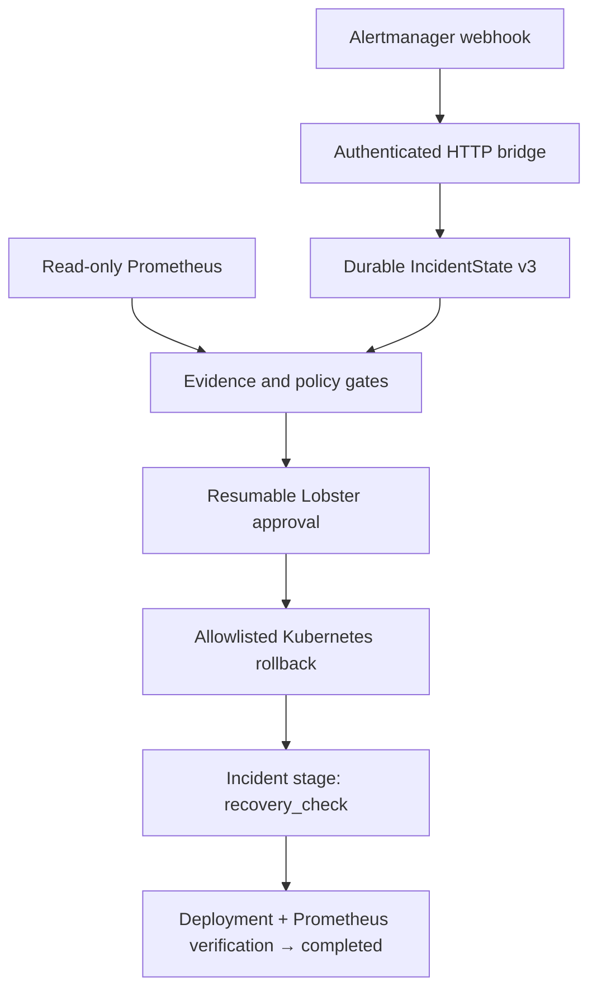

# OpenClaw DataOps Guardian

[](https://github.com/YingzuoLiu/openclaw-dataops-guardian/actions/workflows/ci.yml)

**OpenClaw DataOps Guardian is a safety-focused plugin prototype that turns an
Alertmanager incident into a gated, restart-safe Kubernetes Deployment
rollback.** It persists the incident, collects fresh Prometheus evidence, waits
for human approval, applies at most one exact allowlisted mutation, and marks
the incident complete only after both Deployment readiness and a fresh
Prometheus signal recover.

## Why it exists

A conventional rollback script answers “how do I change the Deployment?”
Guardian focuses on the control failures around that change:

- Can a duplicate alert, retry, or restarted process issue the mutation twice?
- Can an Agent choose an arbitrary cluster, target, command, or patch?
- Does an Alertmanager `resolved` event get mistaken for actual recovery?
- Can an operator inspect why a rollback was allowed, denied, or blocked?
- Does the released proof correspond to the exact source commit being viewed?

The LLM may investigate and propose, but it is never the authority to mutate
infrastructure. Administrator configuration and deterministic Tool, Reducer,
approval, allowlist, idempotency, reconciliation, and recovery gates own that
decision.

Use this repository to study the implementation, run the workflow without a
cluster, or reproduce the full safety matrix in a disposable kind environment.
It is a safety-focused reference prototype, not a production or
multi-cluster remediation service.

> **Status:** The five-step implementation is complete. Release acceptance is
> the exact-head `Full safety proof` CI job, which exercises authenticated
> Alertmanager delivery, durable Gateway state, evidence Tools, resumable human
> approval, one allowlisted kind mutation, restart reconciliation, dual
> Deployment/Prometheus recovery, and cleanup.

## How it works



OpenClaw Gateway sessions persist the incident state. If the Gateway restarts
or a delivery is replayed, Guardian reconciles the stored attempt with the live
Deployment instead of blindly issuing another mutation. A completed incident
therefore means that the approved rollback was audited and both infrastructure
readiness and a fresh application metric passed—not merely that an alert
changed state.

## Try it

Prerequisites:

- Node.js `22.22.2+` on Node 22, `24.15.0+` on Node 24, or Node 26+
- npm

```bash
git clone https://github.com/YingzuoLiu/openclaw-dataops-guardian.git
cd openclaw-dataops-guardian
npm ci
npm run check
```

Choose the proof that matches what you want to inspect:

| Goal | Command | Additional requirements |
|---|---|---|
| Build and run the deterministic test suite | `npm run check` | None |
| Exercise policy, live Agent hooks, HTTP ingestion, crash recovery, and approve/deny paths | `npm run demo:fast` | Linux/WSL Bash; no Docker, cluster, paid API, or external model |
| Reproduce the complete rollback and recovery safety matrix | `npm run demo` | Linux/WSL Bash, Docker, `kind`, `kubectl`, and image-pull network access |

The full demo creates exactly one disposable kind cluster from digest-pinned
images, uses a scoped ServiceAccount, and cleans up the cluster and temporary
credentials before releasing a sanitized `ok: true` report. Both aggregate
demos require a clean committed worktree and bind their reports to its full Git
SHA.

<details>
<summary>Running from a Windows-mounted WSL path</summary>

When invoked from a checkout such as `/mnt/c`, the demo exports the exact clean
commit into a private native-Linux capsule under `/tmp`, restores the
lockfile-pinned dependencies there, and deletes the capsule on exit. It does not
copy the caller's `node_modules` tree or accept uncommitted source as release
evidence. Dependency restoration prefers npm's cache and may contact the npm
registry. A native WSL checkout such as `~/Projects` is faster for repeated
runs.

</details>

Guardian is not published to npm or ClawHub. To inspect or link the plugin into
a dedicated OpenClaw profile, follow the [operator guide](docs/operator-guide.md).
For the full positive/negative matrix and report contract, see the
[final safety proof](docs/final-safety-proof.md).

## Safety boundaries and guarantees

| Boundary | Implemented guarantee | Reproducible evidence |
|---|---|---|
| Alert ingestion | Bearer-token-authenticated loopback HTTP bridge, Alertmanager v4 canonicalization, bounded deduplication, durable deferred-delivery checkpoints | [HTTP bridge contract](docs/alertmanager-http-bridge.md) |
| Evidence | Alert payloads never count as evidence; Prometheus is read-only and its endpoint remains administrator-owned | [Prometheus adapter](docs/prometheus-adapter.md), [evidence gates](docs/evidence-gates.md) |
| State and restart | Schema-v3 incident state, occurrence identity, attempt history, restart reconciliation, and replay-safe transitions | [IncidentState v3](docs/incident-state-v3.md) |
| Approval | Real Lobster run/resume path with pending, approved, and running checkpoints persisted through Gateway sessions | [Lobster compatibility proof](docs/proof-3-lobster-approval.md), [PR #8](https://github.com/YingzuoLiu/openclaw-dataops-guardian/pull/8) |
| Kubernetes mutation | Exact Deployment target, administrator allowlist, UID/revision/template-digest checks, optimistic concurrency, and audit annotations | [Rollback contract](docs/kubernetes-deployment-rollback.md) |
| Idempotency | The same occurrence and key cannot mutate twice; a genuinely new occurrence can execute a later rollback | [Real kind proof](docs/kubernetes-deployment-rollback.md#running-the-real-kind-proof) |
| Recovery | Succeeded-attempt binding, audited Deployment readiness, and fresh administrator-owned Prometheus policy must all pass before `completed` | [Step 4 recovery contract](docs/deployment-prometheus-recovery.md) |
| Final safety proof | Denial, ambiguous restart, off-target/RBAC rejection, resolved-is-not-recovery, scale-to-zero failure, replay protection, sanitization, and cleanup | [Step 5 proof matrix](docs/final-safety-proof.md) |

## Verified results

- **Final safety proof (Step 5):** `npm run demo` combines the no-cost fast
  suite with one isolated kind cluster. Its allowlisted JSON report is emitted
  only after every positive and negative assertion passes and the cluster,
  Gateway, bridge, port-forward, kubeconfigs, and temporary credentials have
  been cleaned up. The live matrix includes unauthenticated ingress, duplicate
  delivery, real Gateway evidence Tools, approval denial, ambiguous restart,
  off-target and RBAC rejection, exactly one rollback dispatch, rollback replay,
  resolved-is-not-recovery, scale-to-zero, fresh dual recovery, completion
  replay after a Gateway restart, and independent completion readback. See the
  [final safety proof](docs/final-safety-proof.md).
- **Real integration proof (Step 3):** approved rollback changed a kind
  Deployment from revision 2 to revision 3 and restored the prior PodTemplate
  (`pause:3.10` to `pause:3.9`). Duplicate calls and post-restart replay left
  the Deployment unchanged; a new occurrence remained eligible for a later
  rollback.
- **Real integration proof (Step 4, 2026-08-08):** `npm run recovery:kind-prometheus-proof`
  against an isolated kind cluster and a real Prometheus server scraping a
  live workload:

  | Signal | Result |
  |---|---|
  | Degraded metric observed | `0.7` |
  | Degraded classification | `critical` |
  | Rollback decision | `rolled_back` |
  | Rollback mutation dispatch count | `1` |
  | Rollback replay decision | `duplicate` |
  | Restart reconciliation | `confirmed_succeeded` |
  | Deployment healthy | `true` (desired `1`, available `1`) |
  | Prometheus healthy | `true` (`1` against threshold `0.95`) |
  | Recovery replay blocked | `true` |
  | Incident completed | `true` |
  | Completed state survived Gateway restart | `true` |
  | Cluster cleanup | passed |

  Full contract and reproduction steps: [Step 4 recovery contract](docs/deployment-prometheus-recovery.md).
- **Automated acceptance:** the TypeScript build and Vitest suite run on Node.js
  22.22.2 and Node.js 24.15.0. After they pass, CI runs the complete demo on
  Node.js 22.22.2 and validates that its sanitized `ok: true` report is bound
  to the exact checked-out commit.
- **Real-model A/B evaluation:** across 24 independent trials—12 baseline and 12
  gated, forming 12 matched prompt pairs—the language-only baseline released 3
  unsupported conclusions; the gated arm released 0. All observed baseline
  failures came from one deliberately adversarial
  scenario, so this is a narrow reproducible result rather than a production
  failure-rate claim. See the
  [formal result](docs/openrouter-ab-formal-result.md) and
  [machine-readable evidence](evals/openrouter-ab/formal-2026-07-19.json).

## Proof command reference

| Command | What it demonstrates |
|---|---|
| `npm run demo:fast` | No-cost policy, live Agent hook, HTTP bridge/crash recovery, and synthetic approve/deny summary |
| `npm run demo` | Complete Step 5 live safety matrix in one disposable kind cluster |
| `npm run state:v3:restart-proof` | IncidentState v3 persists across Gateway restart |
| `npm run state:restart-reconciliation-proof` | Interrupted attempts reconcile with external state without duplicate mutation |
| `npm run alertmanager:ingestion-proof` | Canonicalization, deduplication, and reducer behavior |
| `npm run alertmanager:http-bridge-proof` | Authenticated webhook ingestion and durable bridge checkpoints |
| `npm run policy:proof` | Loader-backed policy and Hook registration |
| `npm run hooks:live-proof` | Live Gateway finalization gate with a scripted local model |
| `npm run kubernetes:kind-rollback-proof` | Real approval, restart, rollback, idempotency, and cleanup in kind |
| `npm run recovery:kind-prometheus-proof` | Real Step 4 proof: real degraded scrape, rollback, dual recovery, completion, restart readback, and cleanup |
| `npm run eval:openrouter:plan` | No-cost preview of the optional paid A/B schedule |

Some proofs start an isolated OpenClaw Gateway and temporary local services.
Follow the linked contracts and never point proof scripts at a normal OpenClaw
profile or production cluster. Re-running paid model trials is opt-in and
requires the caller to supply `OPENROUTER_API_KEY`.

## Implementation status

| Step | Scope | Status | Evidence |
|---|---|---|---|
| 1 | IncidentState v3, occurrence identity, durable restart reconciliation | Complete | [State contract](docs/incident-state-v3.md), [PR #5](https://github.com/YingzuoLiu/openclaw-dataops-guardian/pull/5) |
| 2a | Alertmanager v4 canonicalization, bounded deduplication, and fail-closed reducer | Complete | [PR #6](https://github.com/YingzuoLiu/openclaw-dataops-guardian/pull/6) |
| 2b | Authenticated HTTP bridge and durable delivery checkpoints | Complete | [PR #7](https://github.com/YingzuoLiu/openclaw-dataops-guardian/pull/7) |
| 3 | Real, gated, allowlisted Kubernetes Deployment rollback in kind | Complete | [PR #8](https://github.com/YingzuoLiu/openclaw-dataops-guardian/pull/8) |
| 4 | Real post-rollback Deployment and Prometheus recovery verification | Complete | [Recovery contract and proof command](docs/deployment-prometheus-recovery.md) |
| 5 | Complete fault/safety proof and final reproducible demo | Complete | [Final safety proof and demo](docs/final-safety-proof.md) |

## Security model and non-goals

The model cannot provide a kubeconfig, API server, arbitrary JSON Patch, shell
command, or `kubectl` arguments. Administrator configuration owns the
Prometheus endpoint and Kubernetes allowlist. Before a write, Guardian checks
the cluster identity, namespace and Deployment, Deployment UID, source and
target revisions, source and target PodTemplate digests, approved running
attempt, idempotency key, and live `resourceVersion`.

This repository deliberately does **not** claim:

- production readiness, high availability, or multi-cluster orchestration;
- that an Alertmanager `resolved` webhook proves application recovery;
- authenticated managed-Prometheus support beyond deployment behind a trusted
  proxy;
- autonomous selection of arbitrary remediation targets;
- statistical generalization from the 24-trial evaluation.

See [SECURITY.md](SECURITY.md), the
[operator guide](docs/operator-guide.md) for baseline installation and
read-only Prometheus configuration, the
[rollback contract](docs/kubernetes-deployment-rollback.md) for the mutation
boundary, and the [final safety proof](docs/final-safety-proof.md) for the
end-to-end negative and positive cases.

## Repository map

| Path | Purpose |
|---|---|
| `src/state/` | Incident schema, workflow transitions, reducer, and restart reconciliation |
| `src/alertmanager/` | Webhook canonicalization and standalone HTTP bridge |
| `src/policy/`, `src/hooks/`, `src/tools/` | Evidence policy and deterministic Agent/Tool gates |
| `src/runtime/` | Durable approval-to-remediation and verified-recovery persistence entries |
| `src/kubernetes/` | Scoped Kubernetes configuration and rollback implementation |
| `src/recovery/` | Dual Deployment and Prometheus recovery verifier |
| `workflows/` | Lobster approval workflows |
| `scripts/` | Local component proofs, final demo runners, fixtures, and evaluation runners |
| `docs/` | Contracts, proof reports, security boundaries, and operator guidance |
| `CHANGELOG.md` | Source-release history |

## Version contract

- Node.js `22.22.2+` on Node 22, `24.15.0+` on Node 24, or Node 26+
- OpenClaw `2026.6.34` for the `v0.2.0` compatibility proofs
- Lobster plugin `2026.6.34` for approval/resume compatibility
- Plugin/Gateway compatibility floor `>=2026.6.34`

The compatibility range should be widened only after the proofs are repeated
against newer stable releases.

## License and project feedback

Licensed under the [MIT License](LICENSE). For bugs or design discussion, open
a [GitHub issue](https://github.com/YingzuoLiu/openclaw-dataops-guardian/issues).
For security reports, follow [SECURITY.md](SECURITY.md).
