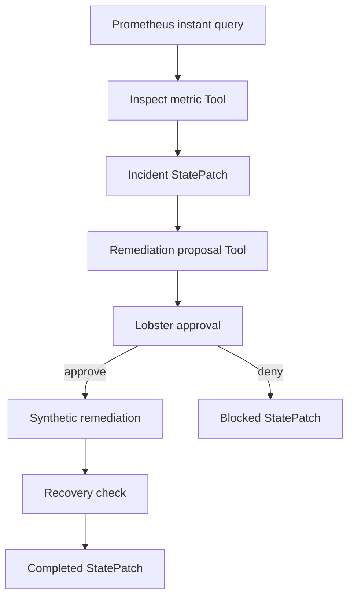

# First vertical slice

Status: **passed** locally on 2026-07-18 with `openclaw@2026.6.9` and
`@openclaw/lobster@2026.6.9`.

This slice uses the Prometheus HTTP API boundary for its metric input and a
loopback mock server in the reproducible proof. It exercises the complete
orchestration and persistence boundary without touching a production metric
system or executing a real rollback.



## Approved path

The live proof ran `start`, stopped the Gateway, restarted it, and then ran
`resume approve`.

```text
start  -> stage=approval, approvalStatus=pending,
          currentValue=0.7, metricSource=prometheus,
          classification=critical,
          proposedAction=rollback_latest_release,
          workflowStatus=needs_approval

resume -> stage=completed, approvalStatus=approved,
          evidenceCount=4, workflowStatus=ok
```

The projected final incident contains evidence from four owners. The first
entry retains the exact PromQL as its source:

1. `prometheus:payment_success_rate{service="payments",environment="proof"}`;
2. `guardian_propose_remediation`;
3. `lobster_remediation`;
4. `lobster_recovery_check`.

## Denied path

The same alert was run in a separate session and resumed with `deny`:

```text
resume -> stage=blocked, approvalStatus=denied,
          evidenceCount=2, workflowStatus=cancelled
```

No remediation or recovery evidence was added. Lobster represents a denied
approval as `cancelled`, while Guardian records the business state as `blocked`.

## Architecture boundary

- The plugin owns the investigation and proposal tools plus the session
  extension projection.
- `guardian_query_prometheus` owns the read-only Prometheus HTTP boundary. Its
  base URL is administrator configuration; the Tool call supplies only PromQL.
- The application client owns the Reducer and persists each durable checkpoint
  through `sessions.pluginPatch`.
- Lobster owns the deterministic approval, remediation, and recovery sequence.
- The embedded workflow does not call back into OpenClaw tools.
- All remediation in this slice is marked `mutatesProduction: false`.

This uses only public OpenClaw seams. It does not import the host's private
session-store implementation.

## Run the proof

From the repository root:

```bash
npm install
npm run slice:proof
```

To verify the deny branch:

```bash
GUARDIAN_PROOF_DECISION=deny \
OPENCLAW_VERTICAL_SESSION_KEY=agent:main:dataops-guardian-deny-demo \
OPENCLAW_VERTICAL_RESUME_FILE="$PWD/.openclaw-proof/deny-demo.json" \
npm run slice:proof
```

The proof uses an isolated `.openclaw-proof` profile, loopback binding, a local
mock Prometheus server, and a temporary device-auth bypass for its local RPC
client. The bypass is removed by the script's exit trap and must not be copied
into a normal Gateway profile.
